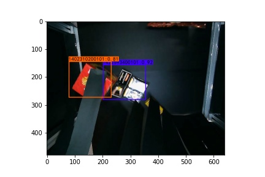

# SSD-Shfflenet


This is use shfflenetv1 and ShuffleNetv2 implement Single Shot Detector(SSD).  


## Requriments
I use tensorflow2 implenment.
```
pip install -r requirments.txt
```

## Train
Step 1: Modify `config.py`  
```
    EPOCHS : The number of iteration. 
    BATCH_SIZE: You can modify size, according to your GPU.

    CLASSES: You want to train classes.
    
    DATASET : Dataset path
    VOC_TEXT_FILE: Dataset train, val, test images information.
    VOC_TRAIN_FILE: Produce train text file.

    MODEL_FOLDER : Stroage weigth folder
    FILE_NAME : Storage weigth weight
```
Step 2: `pip install voc_annotation.py`
You can obtain three text files(train.txt, val.txt and test.txt)  
  
Step 3: `pip install train_300.py`  

## Test
You can look `predict_image.ipynb`.  

### Execute results


## Evalutate model
Step 1: You need use `pip install predict_text.py` produce predicted results' text file.  
Step 2: `pip install evaluate.py`  


## Reference
[Mobilenet-SSD-Essay](https://github.com/bubbliiiing/Mobilenet-SSD-Essay)  
[ShuffleNet V1](https://arxiv.org/abs/1707.01083)  
[ShuffleNet V2](https://arxiv.org/abs/1807.11164)
